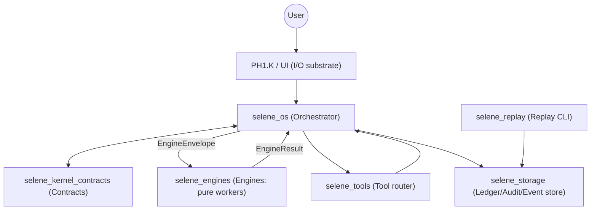

# Selene OS Architecture

## Section A: Purpose
Selene OS is an orchestration-first operating runtime that enforces deterministic execution, safety gates, and auditable outcomes across voice, reasoning, tools, and domain workflows.

## Section B: Kernel vs Constitution (separation)
The kernel defines executable runtime contracts, schemas, and enforcement boundaries. The constitution defines behavioral laws, safety posture, and product principles. Kernel is code-enforced mechanics; constitution is system-wide governance and operating doctrine.

## Section C: Global Gate Order (Identity → STT → NLP → Confirm → Access → Simulation → Domain → Persist/Audit)
All actionable work follows one global order: Identity, then STT, then NLP understanding, then user confirmation (when required), then access/authority, then simulation eligibility, then domain execution, and finally persistence plus audit logging.

## Section D: Engine Orchestration Law (WorkOrder, Blueprint, Simulation)
Selene OS orchestrates by binding each task to a WorkOrder, selecting a Blueprint for deterministic step order, and allowing execution only through declared Simulations for side-effect safety.

## Section E: Engine Call Rule (“Engines never call engines”)
Engines are pure workers. Engines return structured results to Selene OS. Only Selene OS may orchestrate cross-engine flow.

## Section F: No Simulation → No Execution
Any operation with side effects is blocked unless an active simulation exists, all required gates pass, and required confirmations are complete.

## Section F1: Execution Boundary Law — Probabilistic Reasoning, Deterministic Execution
Selene must follow this architectural boundary:

Probabilistic Layer (Allowed):
- Language generation
- Reasoning
- Summarization
- Research
- Data analysis
- Document/photo explanation
- Connector read-only queries
- Tone/personality shaping

These may be model-driven and non-deterministic.

Deterministic Boundary (Mandatory):
- Intent -> dispatch classification
- Access control decisions
- Simulation execution
- State mutation
- Ledger writes
- Artifact activation
- Provider promotion/demotion
- Onboarding progression
- Message sending
- Any irreversible action

All execution must:
- Pass Access checks
- Require ACTIVE simulation IDs (when applicable)
- Be idempotent
- Be replay-safe
- Be auditable
- Fail closed on any inconsistency

Language may be probabilistic.
Execution must never be probabilistic.

## Section G: MVP pipeline summary (PH1.K → PH1.W → PH1.VOICE.ID → PH1.C → PH1.NLP → PH1.X → PH1.D/PH1.E → PH1.WRITE → PH1.TTS → PH1.L + PH1.M/F/J/EXPLAIN)
MVP runtime flow starts with PH1.K voice substrate, PH1.W wake, PH1.VOICE.ID identity binding window, PH1.C transcript quality, PH1.NLP intent draft, PH1.X orchestration, PH1.D/PH1.E constrained phrasing/tool routing, PH1.WRITE final formatting (presentation only), PH1.TTS speech output, and lifecycle/memory/persistence/audit/explain handling through PH1.L and PH1.M/F/J/EXPLAIN.

## Section H: Implementation Rule (Rust-Only)
Selene OS is built and shipped as a Rust-only system:

- All production runtime components (orchestrator, engines, contracts, storage, tools, replay) are implemented in Rust.
- The build, test, and release pipeline must work via `cargo` alone (no Node/Python toolchains required to build Selene).
- Any interaction with non-Rust systems (OS APIs, external services) must be mediated through explicit tool boundaries and still obey the kernel contracts, simulations, and audit rules.

## Section I: Current Understanding (Workspace + Document Layout)
This repo is intentionally organized so the architecture cannot drift from implementation.

Authoritative documents:
- Docs index (read order): `docs/00_INDEX.md`.
- Constitution (governance): `docs/05_OS_CONSTITUTION.md` (non-executable laws and product doctrine).
- Engine registry (one-page inventory): `docs/07_ENGINE_REGISTRY.md`.
- Engine map (runtime flow + boundaries): `docs/06_ENGINE_MAP.md`.
- Kernel contracts (executable envelopes): `docs/04_KERNEL_CONTRACTS.md` (spec) implemented by `crates/selene_kernel_contracts`.
- Build plan (roadmap): `docs/02_BUILD_PLAN.md`.
- Build ledger (verification log): `docs/03_BUILD_LEDGER.md`.

Rust workspace crates (intended responsibilities):
- `crates/selene_kernel_contracts`: shared types + schemas + validators (EngineEnvelope, WorkOrder, EngineResult, IDs).
- `crates/selene_os`: the only orchestrator (gate order, blueprint execution, simulation enforcement, audit emission).
- `crates/selene_engines`: pure workers that implement capabilities; they accept envelopes and return structured results.
- `crates/selene_tools`: tool router and adapters; returns provenance-aware, bounded results to Selene OS.
- `crates/selene_storage`: persistence/audit/event store; idempotency/outbox/retry primitives live here.
- `crates/selene_replay`: replay CLI for deterministic reconstruction from stored audit/event history.

## Section J: Dependency & Call Graph Rules (Enforced by Design)
- `selene_kernel_contracts` is the root dependency; it must not depend on `selene_os`, engines, storage, or tools.
- Engines depend on kernel contracts (and pure libraries) only.
- Only `selene_os` may orchestrate cross-engine flow and tool usage.
- Storage is written through Selene OS with idempotency keys and audit correlation.

## Section K: Architecture Layout (Execution Data Flow)

